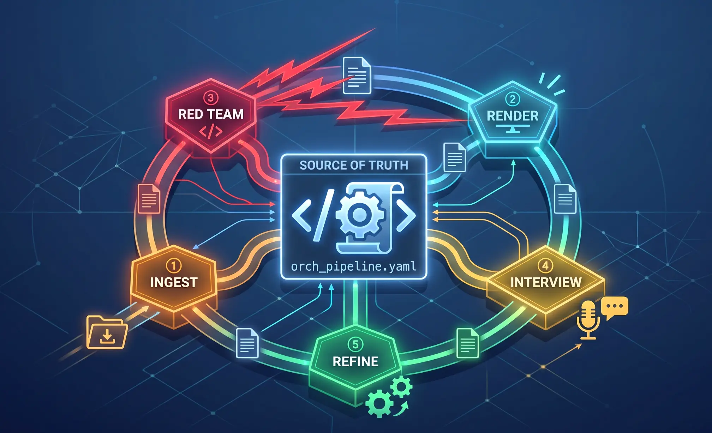

<div align="center">
    
    <h1>Deterministic Document Orchestrator (DDO)</h1>
    <h3><em>An AI-augmented document engine that transforms structured YAML into reproducible PDFs, HTML, and Markdown — with zero hallucinations.</em></h3>
</div>

<p align="center">
    <strong>DDO solves the document reliability problem by making YAML the immutable source of truth and routing every AI cognitive step through mandatory human-in-the-loop gates. No word reaches a rendered document without tracing back to version-controlled data.</strong>
</p>

<p align="center">
    <a href="https://github.com/tjmustard/deterministic-doc-orchestrator/releases/latest"></a>
    <a href="https://github.com/tjmustard/deterministic-doc-orchestrator/stargazers"></a>
    <a href="https://github.com/tjmustard/deterministic-doc-orchestrator/blob/main/LICENSE"></a>
</p>

---

## Table of Contents

- [🤔 What is DDO?](#-what-is-ddo)
- [⚡ Get Started](#-get-started)
- [📚 Core Architecture](#-core-architecture)
- [📂 Directory Structure](#-directory-structure)
- [🔄 Pipeline Workflow](#-pipeline-workflow)
- [📄 Schema Contract](#-schema-contract)
- [🖨️ Supported Output Formats](#️-supported-output-formats)
- [❓ Troubleshooting Overview](#-troubleshooting-overview)
- [🗺️ Roadmap](#️-roadmap)
- [🤝 Support](#-support)
- [📄 License](#-license)

## 🤔 What is DDO?

DDO is an AI-augmented document engine that converts structured YAML source files into reproducible PDFs, HTML, and Markdown via a strict 5-phase pipeline: **Ingest → Render → Red Team → Interview → Refine**.

The core problem DDO solves: AI-assisted document generation is unreliable because the AI operates as a black box — hallucinating facts, inventing citations, and producing outputs that cannot be verified against a ground truth. DDO eliminates this by separating _data_ (YAML, version-controlled, human-verified) from _presentation_ (templates, deterministically applied). The AI performs cognitive work — extraction, critique, refinement — but never writes directly to the final document.

## ⚡ Get Started

### Prerequisites

- [Python 3.10+](https://www.python.org/downloads/)
- [uv](https://docs.astral.sh/uv/) — package manager

Typst (for PDF rendering) and all other dependencies are installed automatically — no system-level Typst install required.

### Installation

```bash
git clone https://github.com/tjmustard/deterministic-doc-orchestrator.git
cd deterministic-doc-orchestrator
uv sync
```

### Running the Build

```bash
# Render a document (PEP 723 hermetic — lockfile enforced)
uv run --locked ddo/build.py --data <path/to/document_data.yaml> --template <template_name> --format <pdf|html|md> --output <output_path>

# Lint (both must pass before any PR)
uv run ruff check .
uv run ruff format --check .

# Tests
uv run pytest
uv run pytest tests/unit/        # unit only
uv run pytest tests/integration/ # integration only
```

## 📚 Core Architecture

DDO is built on five architectural pillars that together enforce reproducibility and eliminate hallucination:

1. **YAML as Source of Truth** — `document_data.yaml` is the immutable data layer. Rendered documents are derived outputs. Never patch a rendered document directly; always patch the YAML and re-render.
2. **Zero-Hallucination Enforcement** — Any schema field that cannot be verifiably filled from source material is written as the literal string `[REQUIRES USER INPUT: <reason>]`. Dates, metrics, and technical specifics are never invented.
3. **Human-in-the-Loop (HITL) Gates** — Every pipeline phase ends with `[WAITING FOR USER REVIEW]`. The system does not auto-advance to the next phase. The human is the gate.
4. **Adversarial Red Team** — A persona-driven critique pass reads the Jinja2/Markdown render (not the PDF) for AI-parseable adversarial review. Both formats derive deterministically from the same YAML, making the critique mathematically valid for the PDF while guaranteeing 100% accurate AI text parsing.
5. **YAML Mutation Layer** — `red_team_report.yaml` and `interview_log.yaml` are the machine-readable mutation data. Ephemeral human-review Markdown files are read-only and must never be parsed programmatically.

## 📂 Directory Structure

```
ddo/
├── build.py          # PEP 723 hermetic build orchestrator (`uv run --locked ddo/build.py`)
├── validation.py     # Importable validation gate (validate() + ValidationError)
├── paths.py          # Pure path helpers (slug sanitizer + path containment check)
├── ingest.py         # Atomic write, overwrite guard, fabrication tripwire
├── schemas/          # YAML schema contracts (prd.yaml, scientific_report.yaml)
├── templates/        # Typst (.typst) and Jinja2 (.jinja2) rendering templates
├── personas/         # Adversarial review lenses (product_critic, scientific_reviewer)
├── fonts/            # Bundled DejaVu fonts (hermetic — no system fonts required)
└── skills/           # ddo-ingest.md and ddo-render.md cognitive node definitions

scripts/              # fixture_signoff_guard.py — pre-commit/CI guard for fixture promotion
tests/
├── unit/             # Pure unit tests (validation, paths, ingest, persona structure)
├── integration/      # End-to-end render determinism + ingest contract tests
├── fixtures/         # Human-promoted golden regression baselines (DDO_FIXTURE_SIGNOFF=1)
└── data/             # Test input YAML files (example documents)

spec/compiled/        # Ground truth: architecture.yml, SuperPRD.md
tutorials/            # Step-by-step workflow tutorials (ddo-v001-prd-workflow/, ...)
Documents/            # Generated output — gitignored; YYYY.MM.DD_DocType_Title/ structure
.agents/              # HACF framework toolchain (skills, schemas, rules, scripts, memory)
.claude/              # Claude Code slash command bridges and settings
```

## 🔄 Pipeline Workflow

The DDO pipeline is strictly sequential. Each phase produces a verifiable artifact before the next phase begins.

### Phase 1: Ingest (`ddo-ingest`)
1. Read all provided source materials (documents, URLs, notes).
2. Map extracted facts to the target YAML schema.
3. Mark any unverifiable field as `[REQUIRES USER INPUT: <reason>]` — never invent values.
4. Write the result to `<output_dir>/document_data.yaml`.
5. Present a summary of populated vs. missing fields.

**`[WAITING FOR USER REVIEW]`** — User fills missing fields and approves before proceeding.

### Phase 2: Render (`ddo-render`)
1. Scan `document_data.yaml` for any remaining `[REQUIRES USER INPUT]` strings — abort if found.
2. Invoke `uv run ddo/build.py` with the target template and format.
3. Output the path to the generated file.

**`[WAITING FOR USER REVIEW]`** — User reviews the rendered document and approves before proceeding.

### Phase 3: Red Team (`ddo-red-team`)
1. The assigned persona reads the Jinja2/Markdown render (not the PDF).
2. Produces adversarial critique targeting accuracy, clarity, completeness, and claim support.
3. Writes findings to `red_team_report.yaml`.

**`[WAITING FOR USER REVIEW]`** — User reviews the critique and approves which findings to address.

### Phase 4: Interview (`ddo-interview`)
1. Structured Q&A between the assigned persona and the document author role.
2. Each approved finding from Phase 3 is resolved through structured dialogue.
3. Resolutions are written to `interview_log.yaml`.

**`[WAITING FOR USER REVIEW]`** — User reviews and approves the interview log before mutations are applied.

### Phase 5: Refine (`ddo-refine`)
1. Apply approved mutations from `interview_log.yaml` to `document_data.yaml`.
2. Re-run `ddo-render` to produce the updated document.
3. Final human review.

## 📄 Schema Contract

Every `document_data.yaml` must satisfy the DDO minimal contract:

1. A **`meta` block** with the following fields: `doc_type`, `title`, `version`, `date`, `persona`, `template`, `output_formats`.
2. An **`evidence_bank` array** — every claim referenced in `content.sections[*].evidence` must have a corresponding ID entry here.

```yaml
meta:
  doc_type: scientific_report
  title: "Example Document"
  version: "1.0"
  date: "2026.06.29"          # dotted date format
  persona: scientific_reviewer  # optional — used by Red Team phase
  template: scientific_report
  output_formats: [pdf, html, md]

evidence_bank:
  - id: ev-001
    source: "Smith et al. (2024)"
    quote: "..."

content:
  sections:
    - title: "Introduction"
      body: "..."
      evidence: [ev-001]
```

See `ddo/schemas/prd.yaml` and `ddo/schemas/scientific_report.yaml` for the full canonical schemas.

## 🖨️ Supported Output Formats

| Format | Engine | Extension |
|---|---|---|
| PDF | Typst | `.pdf` |
| HTML | Jinja2 | `.html` |
| Markdown | Jinja2 | `.md` |

## ❓ Troubleshooting Overview

- **`[REQUIRES USER INPUT]` appears in output**: The Ingest phase left unfillable fields. Open `document_data.yaml`, fill the marked fields manually, then re-run `ddo-render`.
- **Typst compilation error**: Check that all YAML fields referenced in the template exist and are non-null. A missing or null field causes a template failure.
- **Red Team produces hallucinations**: Ensure the Red Team persona is reading the Jinja2/Markdown render, not the PDF. The PDF is not machine-parseable for this purpose.
- **Mutations not applying**: `interview_log.yaml` mutations must be patched into `document_data.yaml` then re-rendered — never edit a rendered document directly.
- **Schema validation error**: Both `meta` block and `evidence_bank` array are required. See the Schema Contract section above.

## 🗺️ Roadmap

- [x] Core Pipeline (v0.0.1)
  - [x] `ddo-ingest` skill
  - [x] `ddo-render` skill
  - [ ] `ddo-red-team` skill
  - [ ] `ddo-interview` skill
  - [ ] `ddo-refine` skill
  - [x] `build.py` hermetic build orchestrator (PEP 723, bundled Typst + fonts)
  - [x] `validation.py` importable validation gate
  - [x] `paths.py` slug sanitizer + path containment
  - [x] `ingest.py` atomic write, overwrite guard, fabrication tripwire
- [x] Schemas (v0.0.1)
  - [x] PRD schema (`ddo/schemas/prd.yaml`)
  - [x] Scientific report schema (`ddo/schemas/scientific_report.yaml`)
- [x] Templates (v0.0.1)
  - [x] Typst PRD template
  - [x] Typst scientific report template
  - [x] Jinja2 HTML templates (autoescape enabled)
  - [x] Jinja2 Markdown templates
- [x] Personas (v0.0.1)
  - [x] Product Critic
  - [x] Scientific Reviewer
- [x] Test Suite (v0.0.1)
  - [x] 78 tests passing (unit + integration)
  - [x] Golden regression baselines with human sign-off guard
- [x] Tutorials (v0.0.1)
  - [x] PRD YAML workflow tutorial (`tutorials/ddo-v001-prd-workflow/`)
  - [ ] Scientific report workflow tutorial (planned v0.0.2)
- [ ] Red Team / Interview / Refine pipeline phases (v0.0.2+)

## 🤝 Support

For support, bug reports, or feature requests, please open a GitHub issue.

## 📄 License

This project is licensed under the terms of the MIT open source license. Please refer to the [LICENSE](./LICENSE) file for the full terms.
